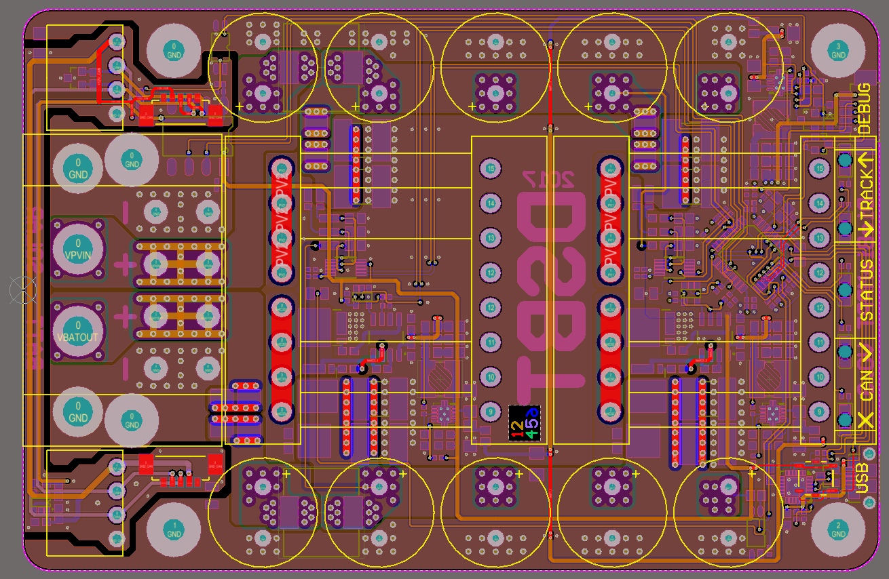

# DieBieMPPT
This is my MPPT project I am doing for a solar boat racing application called the DieBieMPPT. 

The hardware currently presented in this repository could serve as a devellopment platform for if you want to design / devellop your own MPPT, eventually hopefully this project will mature into a usable MPPT for solarboat racing.

<b>THIS HARDWARE IS UNTESTED!!!!</b>

The DieBieSlave looks like this:

So far I confirmed that the following hardware works:
* uController
* CAN bus
* Power supplies
* LED's

Blinky DEMO:

